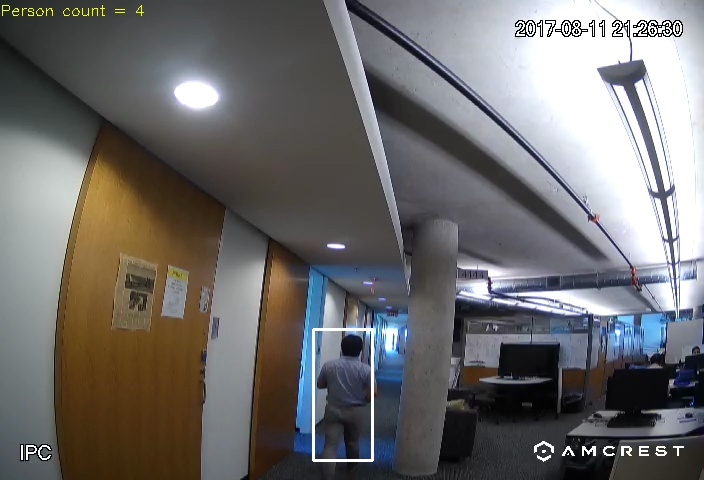
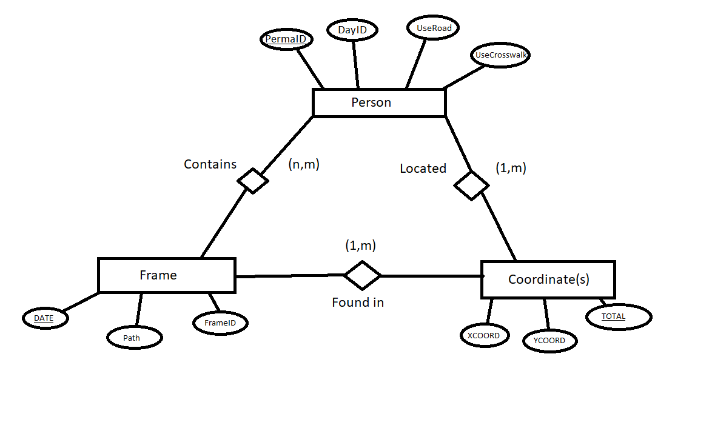

# Sage Pedestrian Lite


---------------------------------------------------------------------------------------------------------------------------------------------------------------------------------

### Description of repo content

---------------------------------------------------------------------------------------------------------------------------------------------------------------------------------
**Students:** Francisco Lozano, Justin Derus, Wesley Kwiecinski                   
**Mentors:** Pratool Bharti, Michael Papka            
---------------------------------------------------------------------------------------------------------------------------------------------------------------------------------
**Useful Sources:**
- Ported from https://github.com/ddiLab/SagePedestrian 
- Open CV Image Writing: https://docs.opencv.org/3.4/d4/da8/group__imgcodecs.html (Python is below c++)  
- Open CV Line Drawing Documentation: https://docs.opencv.org/4.x/dc/da5/tutorial_py_drawing_functions.html  
- Object Detection Tutorial: https://tensorflow-object-detection-api-tutorial.readthedocs.io/en/latest/auto_examples/plot_object_detection_saved_model.html  
- Deep Re-id: https://github.com/KaiyangZhou/deep-person-reid  

---------------------------------------------------------------------------------------------------------------------------------------------------------------------------------
## STEPS TO GETTING THE CODE UP AND RUNNING (on SageEDU nodes):

### Prerequisites

- Acquire a SageEDU node and bootstrap it following the [SageEdu](https://github.com/ddiLab/SageEdu) repo. This will set up the operating system, python, virtual environments, github, and the camera.

- Acquire [jetson-inference](https://github.com/dusty-nv/jetson-inference/) to do object detection following this [video](https://www.youtube.com/watch?v=bcM5AQSAzUY&t=1s)

### Creating the virtual environment

1. Following the documentation on [SageEdu](https://github.com/ddiLab/SageEdu/blob/main/setup/general/pythonSetup.md) create a pip environment by running this command `virtualenv ./PedLite`

2. Activate the environment by running `source PedLite/bin/activate`
>Note: Stay in this virtual environment in the preceding steps. Whenever you want to detect pedestrians you have to activate this environment

3. Clone this repo to your nano `git clone https://github.com/ddiLab/SagePedestrianLite.git`

### Downloading required pip libraries & apt packages

Download the required pip libraries by running `pip install [library name]`

**Libraries to install**
- numpy
- cv2
- shapely (you must download libgeos-dev first)
- sympy
- recordtype
- pascal_voc_writer
>Note: When downloading pip libraries be careful with using `sudo`. Using this will cause the package to **NOT** be downloaded in your virtual environment, but rather in the global python directory


Download the required apt packages by running `sudo apt-get install [package name]`

**Packages to install**
- libgeos-dev

**Torch Libraries**

Lastly, you need to install the **torch libraries**, but in the jetson nano you must do this using pre-built PyTorch pip wheels. To do so, follow this [forum](https://forums.developer.nvidia.com/t/pytorch-for-jetson-version-1-11-now-available/72048). Make sure you download the correct combination of Pytorch and torchvision based on your python version. Pay attention to what version of Pytorch gets download some of those pip wheels will result to another version getting downloaded. Finally, if you mismatch the wrong versions of pytorch and torchvision you will get an error. To install the right versions make sure you uninstall the previous version you downloaded since the install script will not do so.

### Download Deep-Person-reid to do Re-identification

1. cd into this repo in your computer and clone this repo
    ```
    git clone https://github.com/KaiyangZhou/deep-person-reid.git
    ```

2. Make sure you have your virtual environment activated `source PedLite/bin/activate`

3. cd into the deep-person-reid directory that was just created inside the SagePedestrianLite directory

4. install dependencies by running this command `pip install -r requirements.txt`

5. install torchreid `python setup.py develop`
>Note:  `Module 'disutils' has no attribute 'version' ` is a know bug in pytorch so you have to run this command to fix it `pip install setuptools==59.5.0`

***Reference their Github repo for more information [Deep-Person-Reid](https://github.com/KaiyangZhou/deep-person-reid#installation)***

### Modifying the Armcrest Camera stream

To modify the camera stream go to your internet browser in your Jetson nano and type in the camera's ip address in the search bar ***reference [SageEdu](https://github.com/ddiLab/SageEdu/blob/main/setup/general/pythonSetup.md) on how to find your camera's ip address***. After that is done set up a new password after logging in with the default log in creds:
```
Username: admin
Password: admin
```

Once you are logged in you can modify the camera stream such as the timestap.
```
setup > Camera > video... then select overlay to modify the timestamp
```

### Setting up your Sql Lite Database

After the images are analyzed the python script saves the pedestrian's coordinates in a database sitting in the jetson nano. To download sql lite in your EDU node run this command `sudo apt install sqlite3`. Go into the sqlite3 command line and create a database called `pedestrian_detections` and the tables specified in `SagePedestrian.sql`. Once that is done, put the .db file in this directory (i.e. SagePedestrianLite/)



### Runnning the Python Scripts

#### TakePictures.py

Before you run this script you are going to have to change the `username`, `password`, and `camIP` variable to match your camera details. This script will take pictures and organize them by date in the `image` folder until you press `ctrl + c`. Before you run any other python scripts, **this script must be ranned first**. Essentially, the following scripts analyze the pictures this script took.

#### Setting up a new environment

The scripts currently uses `/Images/env/Env1.jpg` as a generic image for overlaying the pedestrain's trajectory. To set up the script for a new environment take a picture generated from `TakePictures.py` and move it into the `/Images/env/` folder. After this is done change the `Env_Image` global variable in `plot_lines.py` to the name of the new .jpg file sitting in `/Images/env/`.

#### The rest of the python scripts

1) Make sure that the .jpg files for the day you run exist in this directory `Images`
2) To run the pedestrian_detection script STANDALONE, follow this format: "python pedestrian_detection.py [hour_min] [hour_max] [date1, date2, ...]"
    - Where hours are optional, dateN = yyyy/mm/dd
    - Otherwise running plot_object detection will call pedestrian_detection and plot lines.
4) If not running pedestrian detection alone, use `python plot_object_detection.py`, which will use the current date.
5) The output of the pedestrian_detection.py script will be found in `/image_label_xmls/crosswalk_detections/(ran_date)`

**TROUBLESHOOTING**
 - 

*This material is based upon work supported by the National Science Foundation under Grant No. OAC 1935984.*
